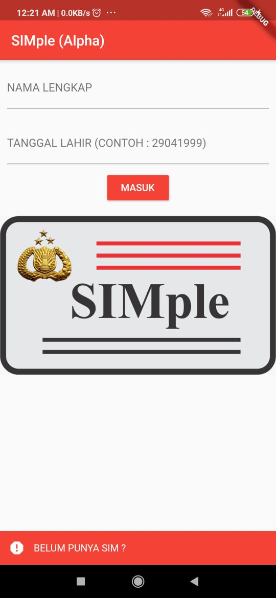
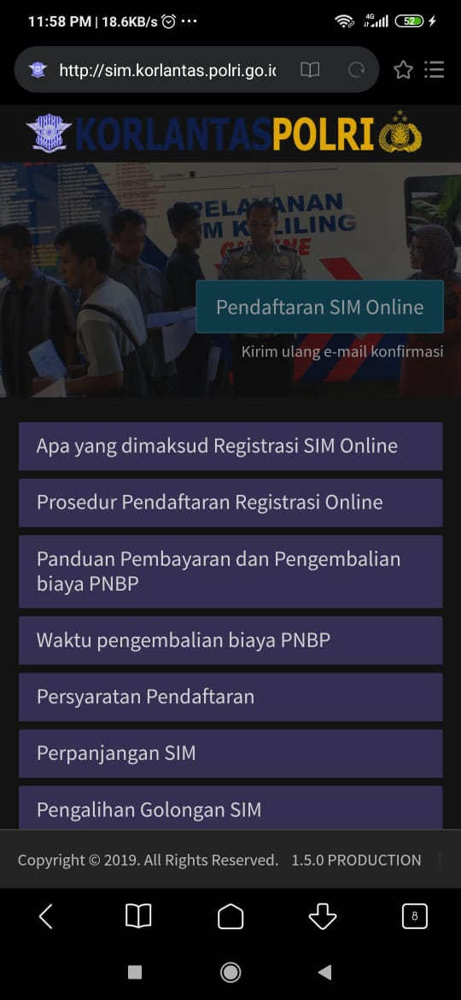
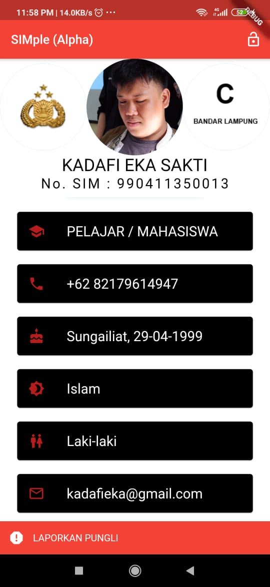
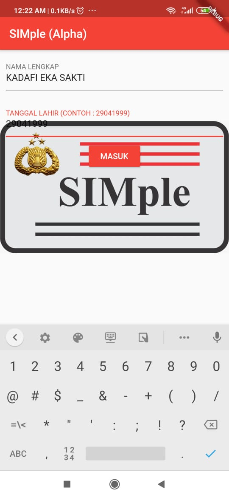

SIMple
Sebuah aplikasi yang menampilkan data SIM seseorang

merupakan project mata kuliah "Mobile Computing"
Anggota kelompok :
1. Kadafi Eka Sakti 1715061022
2. Hendy Syuhada    1715016018

Semua data user dummy dan masih disimpan di dalam database lokal dengan package SQFlite
untuk login dapat menggunakan 
NAMA LENGKAP : u
TANGGAL LAHIR : 123
dengan mengklik tombol masuk

di bottombar terdapat tombol "Belum punya SIM ?", yang jika di klik akan direct ke website pendaftaran SIM online

Merupakan halaman utama setelah login, semua data dummy dan tidak ada pada databse, 
terdapat icon kunci yang berfungsi sebagai tombol Sign Out

Merupakan halamn webview untuk webpage saber pungli, setelah mengklik "laporkan pungli" pada bottombar

